# Zero Knowledge

<!-- Notes in Zero Knowledge -->

<!-- more -->

## Basic Zero Knowledge

Definition: A **proof system** for membership in $L$ is an algorithm $V$ such that $\forall$ $x$:

- Completeness: If $x \in L$, then $\exists$ $\pi$, $V(x,\pi) = \textsf{ACCEPT}$. 
- Soundness: If $x \notin L$, then $\forall \pi, V(x, \pi)= \textsf{REJECT}$. 

---

Definition: A **NP proof system** for membership in $L$ is an algorithm $V$ such that $\forall$ $x$:

- Completeness: If $x \in L$, then $\exists$ $\pi$, $V(x,\pi) = \textsf{ACCEPT}$. 
- Soundness: If $x \notin L$, then $\forall \pi, V(x, \pi)= \textsf{REJECT}$. 
- Efficiency: $V(x,\pi)$ halts after at most $ploy(|x|)$ steps. 

---

Definition: $L \in \mathcal{P}$ if there is a poly-time algorithm $\mathcal{A}$ such that $L = \{x \mid A(x) = \textsf{ACCEPT}\}$. 

---

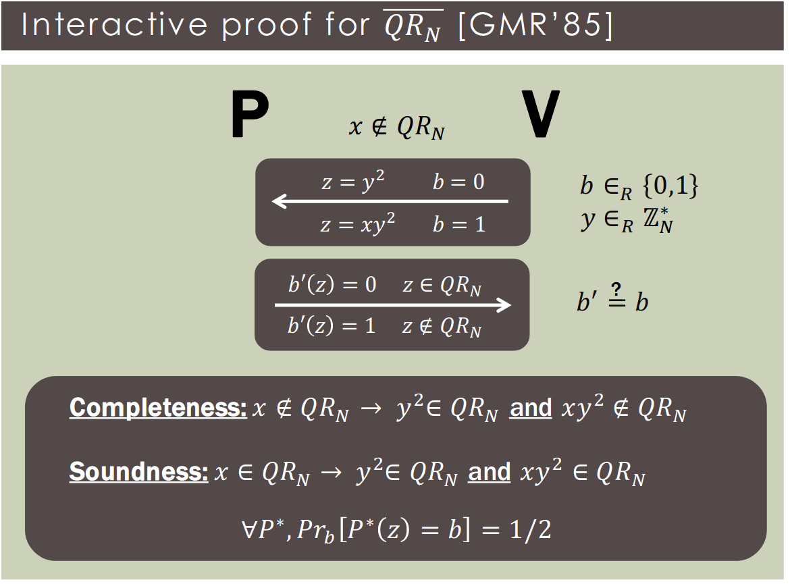

---

Definition [GMR'85]: An interactive proof system for $L$ is a $PPT$ algorithm $V$ and a function $P$ such that $\forall$ $x$:
- Completeness: If $x \in L$, then $\Pr[(P, V) \text{ accepts } x] \ge 2/3$. 
- Soundness: If $x \notin L$, then $\forall P^*, \Pr[(P^*,V) \text{ accepts } x] \leq 1/3$. 

1. Completeness and soundness can be bounded by any $c: \mathbb{N} \rightarrow [0,1]$ and $s: \mathbb{N} \rightarrow [0,1]$ as long as
   - $c(|x|) \geq 1/2 + 1/poly(x)$, 
   - $s(|x|) \leq 1/2 - 1/poly(x)$. 
2. $poly(|x|)$ independent repetitions $\rightarrow c(|x|) - s(|x|) \geq 1 - 2^{-poly(|x|)}$. 
3. $\mathcal{NP}$ is a special case (c(|x|) = 1 and s(|x|) = 0). 
4. $\mathcal{BPP}$ is a special case (no interaction). 

---

Proposition: $\overline{QR_N} \in \mathcal{IP}$. 
- NP proof for $\overline{QR_N}$ not self-evident.
- This suggests that maybe $\mathcal{NP} \subset \mathcal{IP}$. 
- Turns out that $SAT \in \mathcal{IP}$ (in fact $\#SAT$). 

---

Theorem [LFKN'90]: $\mathcal{P}^{\#P} \subseteq \mathcal{IP}$

Theorem [Shamir’90]: $\mathcal{IP} = \mathcal{PSPACE}$

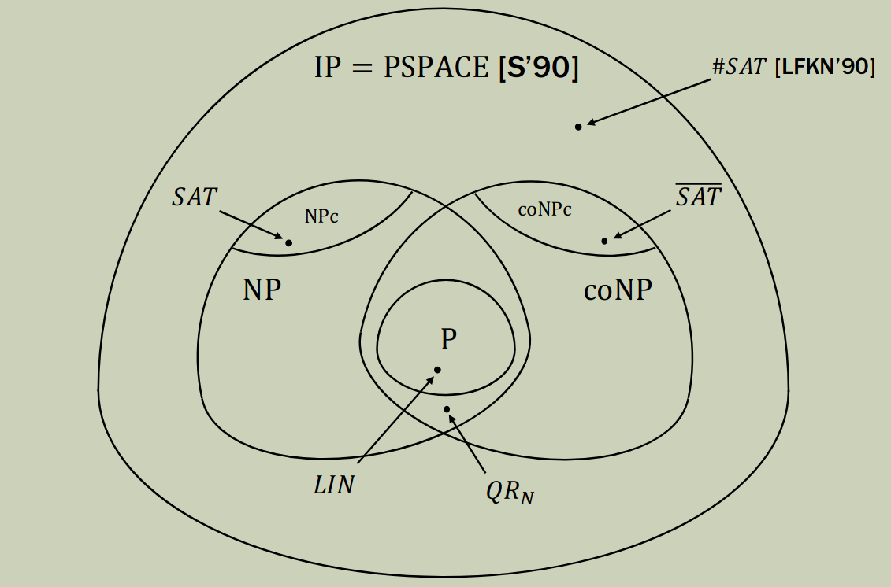

---

Definition [GMR'85]: An interactive proof $(P,V)$ for $L$ is (honest-verifier) zero-knowledge if $\exists \text{ PPT } S \ ~\forall x \in L$: 
$$ S(x) \cong (P, V)(x) \,.$$

- We use $(P, V)(x)$ to denote $V$’s view. 
- Usually $(P, V)(x) = V(view)$ denotes $V$'s output.
- Simulator for $V$'s view implies simulator for $V$'s output.

An interactive proof $(P,V)$ for $L$ is **not** (honest-verifier) zero-knowledge if $\forall \text{ PPT } S \ ~\exists x \in L$: 
$$ S(x) \ncong (P, V)(x) \,.$$

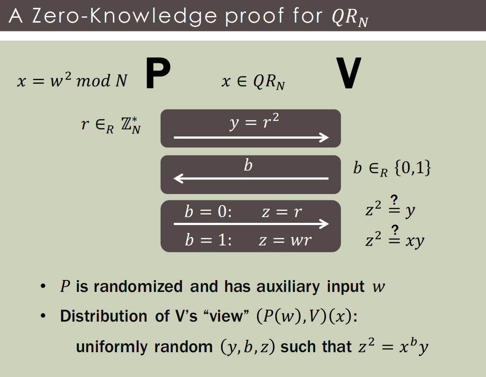

Proposition: $QR_N \in HVZK$. 

---

Definition: An interactive proof $(P,V)$ for $L$ is prefect zero-knowledge if $\forall \text{ PPT } V^* \ ~\exists \text{ PPT } S \ ~\forall x \in L$: 
$$ S(x) \cong (P, V^*)(x) \,.$$

Proposition: $QR_N \in PZK$. 

- "black-box" ZK (stronger): $\exists \text{ PPT } S \ ~\forall \text{ PPT } V^* \ ~\forall x \in L$: 
    $$ S^{V^*}(x) \cong (P, V^{*})(x) \,.$$
- We allowed $S$ to run in expected polynomial time.
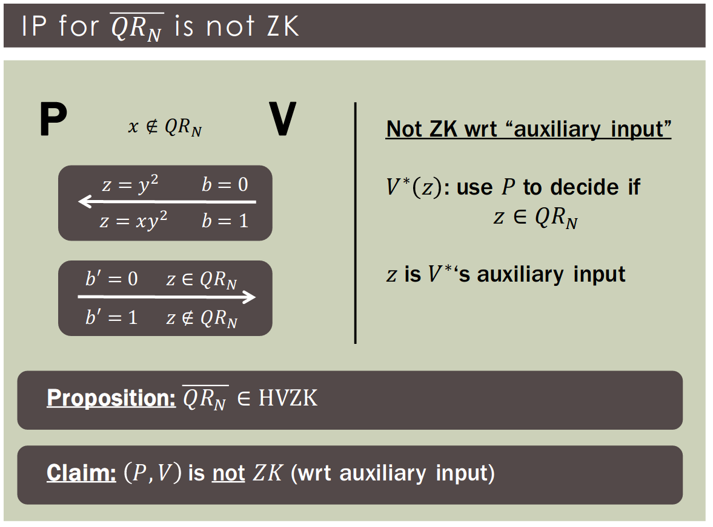

Definition: An interactive proof $(P,V)$ for $L$ is (perfect) zero-knowledge **wrt auxiliary input** if $\forall \text{ PPT } V^* \ ~\exists \text{ PPT } S \ ~\forall x \in L \ ~\forall z$: 
$$ S(x, z) \cong (P, V^*(z))(x) \,.$$

- $z$ captures "context" in which protocol is executed. 
  - Other protocol executions ("environment"). 
  - A-priori information (in particular about $w$).
- Simulator is also given the auxiliary input $z$. 
- Simulator runs in time $poly(|x|)$. 
- Auxiliary input $z$ is **essential for composition**. 

--- 
Theorem: ZK is closed under sequential composition. 

---

## Zero Knowledge and NP 

Theorem [F'87, BHZ'87]: If $SAT \in PZK$ then the polynomial-time hierarchy collapses to the second level. 

---

Statistical ZK: $\forall \text{ PPT } V^* \ ~\exists \text{ PPT } S \ ~\forall x \in L \ ~\forall z$ (我猜有 wrt Auxiliary input): 
$$ S(x, z) \cong_s (P, V^*(z))(x) \,.$$

Theorem [F'87, BHZ'87]: If $SAT \in SZK$ then the polynomial-time hierarchy collapses to the second level. 

---

Computational ZK: $\forall \text{ PPT } V^* \ ~\exists \text{ PPT } S \ ~\forall x \in L \ ~\forall z$: 
$$ S(x, z) \cong_c (P, V^*(z))(x) \,.$$

Theorem [GMW'86]: Suppose one-way functions exist. Then $\mathcal{NP} \subseteq CZK$. 

Theorem [GMW'86]: If statistically-binding commitments exist then $\mathcal{NP} \subseteq CZK$. 

Theorem [B'86]: If statistically-binding commitments exist then $HAM \in CZK$

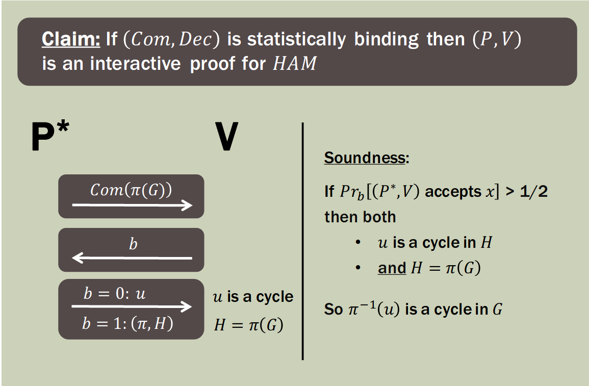

Theorem [OW'90]: If $\exists ZK$ proofs for languages outside of $\mathcal{BPP}$ then there exist functions with one-way instances. 

Theorem [OW'90]: If $\exists ZK$ proofs for languages that are hard on average then there exist one-way functions. 

--- 
$\mathcal{BPP} \subseteq PZK \subseteq SZK \subset CZK = IP$. 

---
Computational ZK: $\forall \text{ PPT } 𝑉^* \ \exists \text{ PPT } S \ \forall D \ \forall x \in L \ \forall z$:
$$|\Pr[D(x, z, S(x, z)) = 1] - \Pr[D(x, z (P, V^*(z))(x), z) = 1] | \leq neg(|x|) $$

## Zero-Knowledge Proof of Knowledge

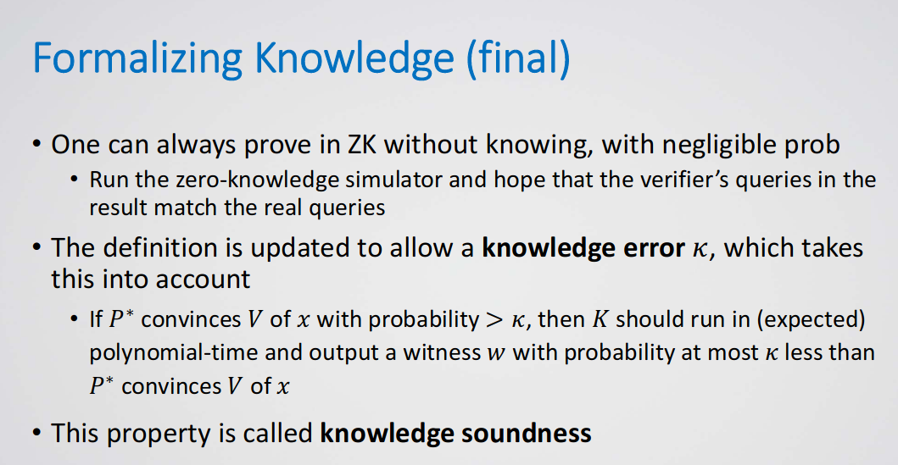

---

A proof system has **knowledge soundness** with error $\kappa$ if there exists a PPT $K$ s.t. for every prover $P^*$, if $P^*$ convinces $V$ of $x$ with probability $\epsilon > \kappa$, then $K^{P^*(\cdot)}(x)$ outputs $w$ s.t. $(x, w) \in R$ with probability at least $\epsilon(|x|) - \kappa(|x|)$. 

**An Alternative Formulation**：

Motivation: one can trade off running time and success probability
- Definition says: run in PPT and output w.p. $\epsilon$
- Alternative definition: run in expected time $\frac{1}{\epsilon}$ and always output

A proof system has knowledge soundness with error $\kappa$ if there exists a $K$ s.t.for every prover $P^*$, if $P^*$ convinces $V$ of $x$ with probability $\epsilon > \kappa$, then $K^{P^*(\cdot)}(x)$ outputs $w$ s.t. $(x, w) \in R$ in expected time $\frac{poly(|x|)}{\epsilon(|x|) - \kappa(|x|)}$. 
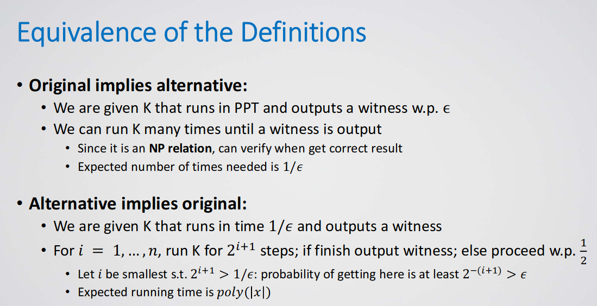

---
A proof system is a zero‐knowledge proof of knowledge if it has
- Completeness: honest prover convinces honest verifier
- Zero knowledge: ensures verifier learns nothing
- Knowledge soundness: ensures prover knows witness

Zero knowledge is a property of the prover
- Prover behavior is guaranteed to reveal nothing
- Protect against a cheating verifier

Knowledge soundness is a property of the verifier
- Verifier behavior guarantees that prover knows witness
- Protect against a cheating prover

---
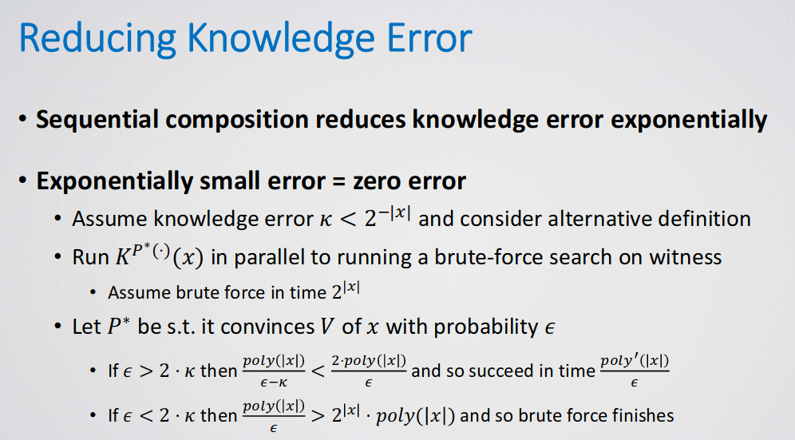

---

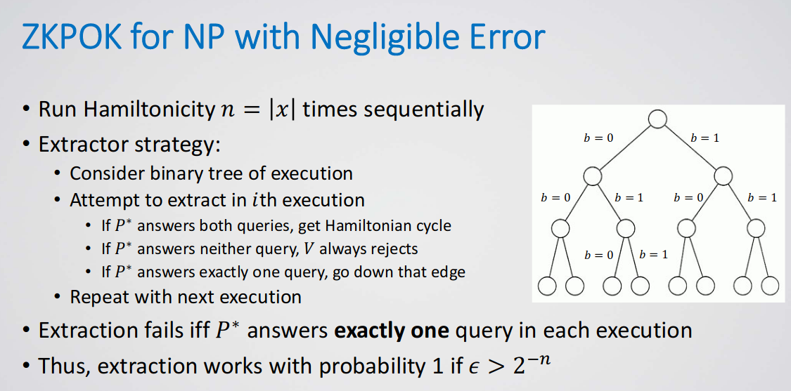

---
**Strong Proofs of knowledge**

A proof system has **strong knowledge soundness** if there exists a negligible function $\mu$ and a (strict) PPT $K$ s.t.for every prover $P^*$, if $P^*$ convinces $V$ of $x$ with probability $\epsilon > \mu$, then $K^{P^*(\cdot)}(x)$ outputs $w$ s.t. $(x, w) \in R$ with probability at least $1 - \mu(|x|)$. 

Theorem: sequential Hamiltonicityis a strong proof of knowledge. 

We cannot construct constant round strong proofs of knowledge. (even for un black-box)

---
**witness‐extended emulation**

A witness‐extended emulator $E^{P^*(\cdot)}(x)$outputs a VIEW and some $w$:
- The view output is indistinguishable from a real execution
- The probability that the view is accepting and yet $(x, w)\notin R$ is negligible
- $E$ runs in expected polynomial‐time

Lemma: If $(P, V)$ is a ZKPOK, then there exists a witness extended emulator for $(P, V)$.
- Very useful when use ZKPOK inside proofs of security (and greatly simplifies)
- Can also formalize an ideal ZK functionality: $\mathcal{F}_{zk}((x, w), x) = (\lambda, R(x, w))$

Lemma: If $(P, V)$ is a ZKPOK, then it securely computes the ideal ZK functionality (in the secure computation sense).

---

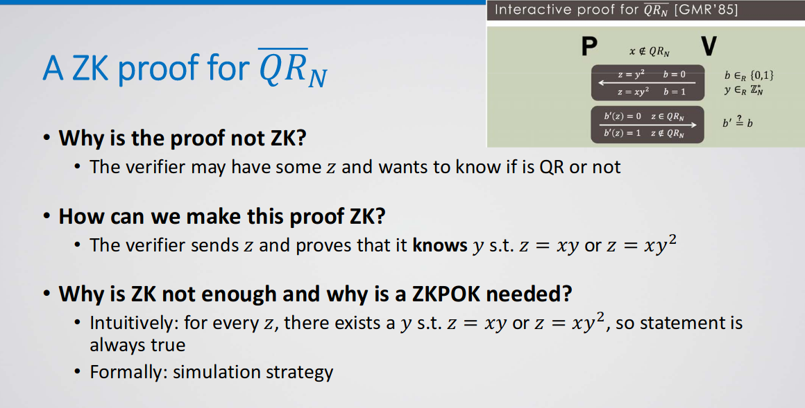

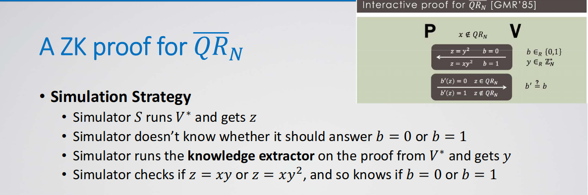

---

## Constant-Round Zero-Knowledge Proofs

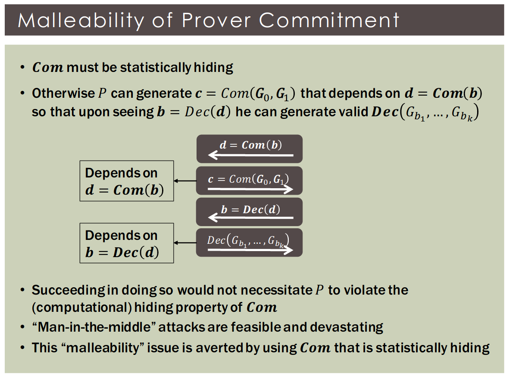

---

Definition: A statistically-hiding $(Com, Dec)$ satisfies:
- Statistical hiding: $\forall R^* \ \forall m_1, m_2$ 
  $$Com(m_1) \cong Com(m_2$$
- Computational binding: $\forall \text{ PPT }C^* \ \forall m_1 \ne m_2$
$$\Pr[C^* \text{ wins the blinding game }] \leq neg(n) $$

---

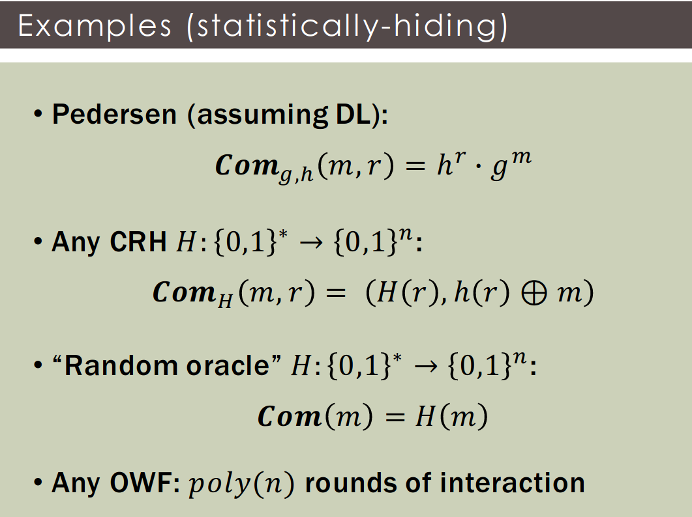

---

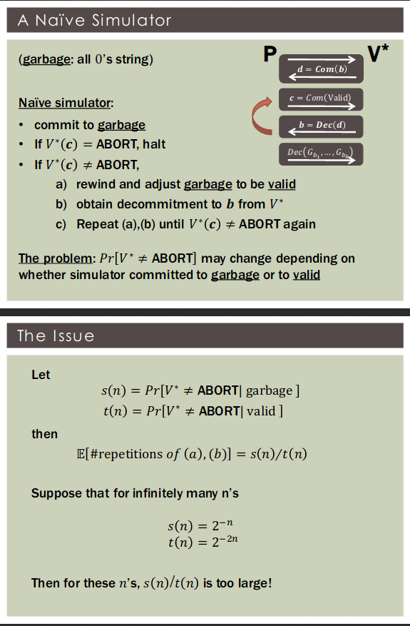

**这里算的是期望，不abort，然后得到valid不停尝试的次数**

Theorem [GK'91]: If statistically-hiding commitments exist then every $L \in \mathcal{NP}$ has a ZK proof with soundness error $2^{-k}$. 

Round-optimal[K'12]: if a language $L$ has a four-round zero-knowledge proof then $L \in coMA$

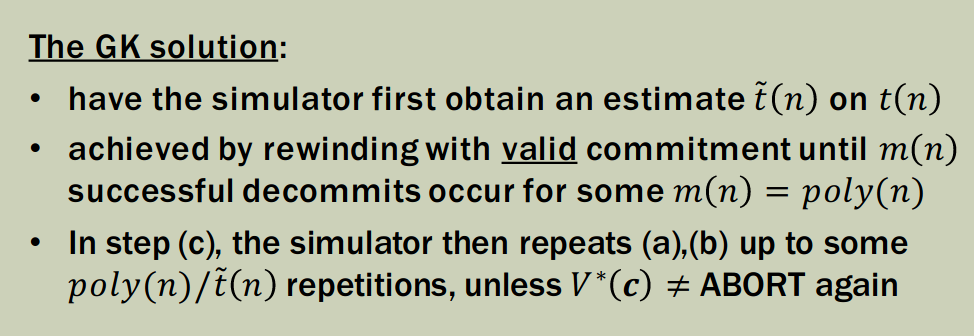

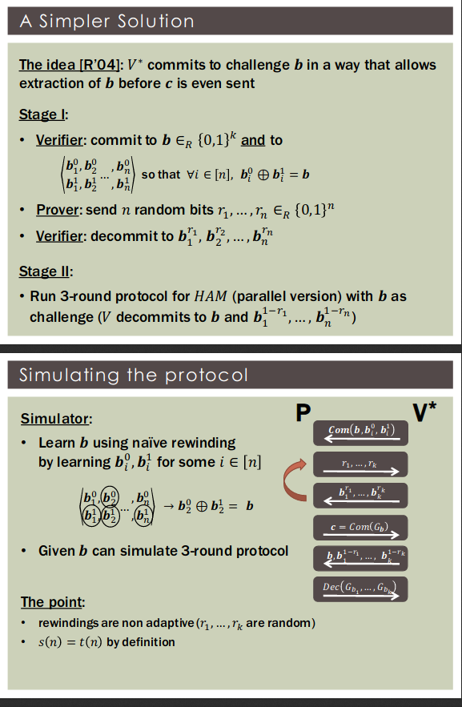

---

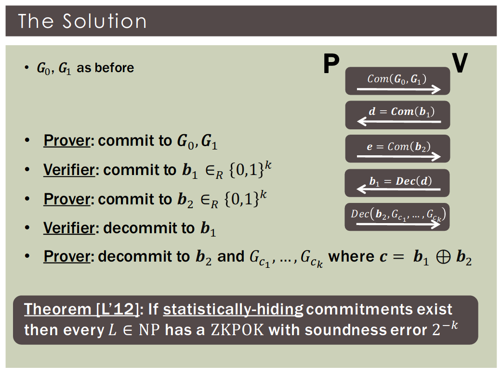
Commitment from prover is statistically-binding. Commitment from verifier is statistically-hiding. 

---
## Witness Indistinguishability and Constant-Round Arguments
Definition [BCC'86]:An interactive argument system for $L$ is a $PPT$ algorithm $V$ and a function $P$ such that $\forall x$:
- Completeness: If $x \in L$, then $\Pr[(P, V) \text{ accepts }x = 1  
- Computational soundness: If $x \notin L$, then $\forall$ PPT $P^*$
$$ \Pr[(P^*,V) \text{ accepts } x] \leq neg(n) $$

1. Computational soundness is typically based on a cryptographic assumption (e.g. CRH)
2. Hardness of breaking the assumption is parametrized by security parameter $n$
3. Independent parallel repetitions do not necessarily reduce the soundness error [BIN'97]

---

CZK Proofs
- Soundness is unconditional (undisputable)
- Secrecy is computational - suitable when secrets are ephemeral  and "environment" is not too powerful
 
SZK Arguments 
- Secrecy is unconditional (everlasting)
- Soundness is computational – suitable when prover is a weak device and no much time for preprocessing

---

$\mathcal{NP} \subseteq SZK arguments$

---

Theorem: If statistically-hiding commitments exist then there exists an SZK argument for $HAM$.

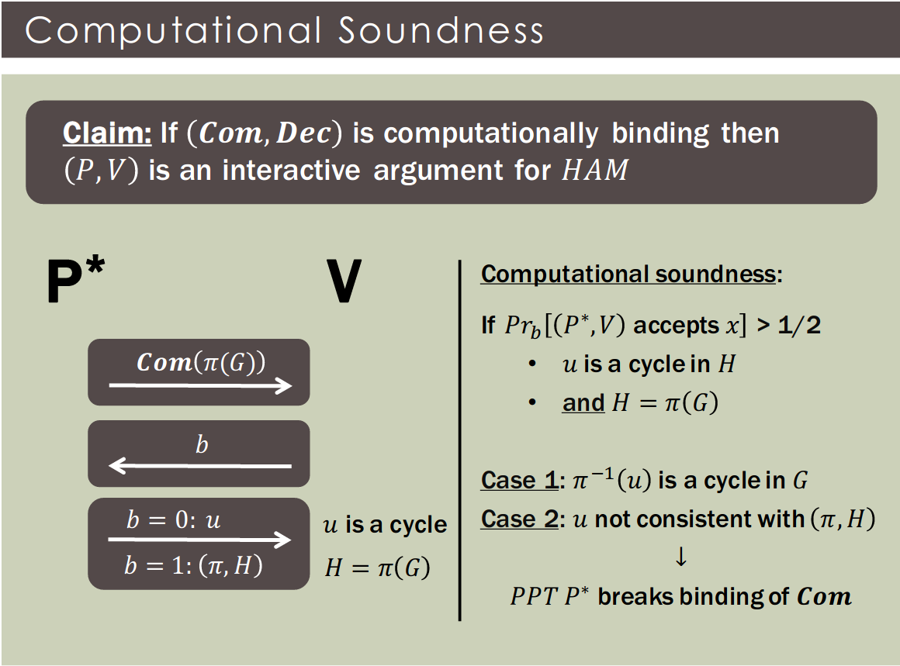

---

Witness-indistinguishable: $\forall w_1, w_2$
$$(P(w_1), V^*)(x) \cong_c (P(w_2), V^*)(x) $$

Witness  independent: $\forall w_1, w_2$
$$(P(w_1), V^*)(x) \cong_s (P(w_2), V^*)(x) $$

Defined with respect to some $\mathcal{NP}$-relation $R_L$.

---

Definition [FS'90]:$(P, V)$ is witness indistinguishable wrt $\mathcal{NP}-relation$ $R_L$ if $\forall$ PPT $V^*$, $\forall w_1, w_2 \in R_L(x)$
$$(P(w_1), V^*)(x) \cong_c (P(w_2), V^*)(x) $$

- Holds trivially (and hence no security guarantee) if there is a unique  witness $w$ for $x \in L$
- Interesting (and useful) whenever more than one $w$
- Holds even if $w_1, w_2$are public and known
- Every ZKproof/argument is also WI
- WI is closed under parallel/concurrent composition

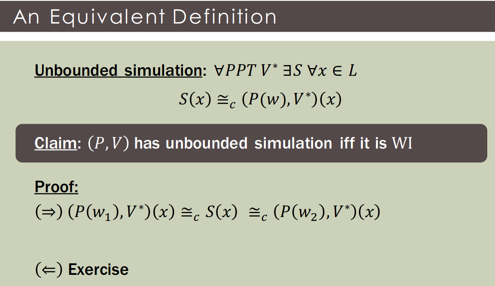

Definition: An interactive proof $(P,V)$ for $L$ is prefect zero-knowledge if $\forall \text{ PPT } V^* \ ~\exists \text{ PPT } S \ ~\forall x \in L$: 
$$ S(x) \cong (P, V^*)(x) \,.$$

---

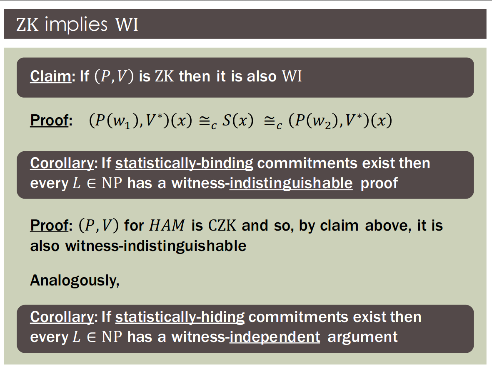

---

Let $(P_k, P_k)$ denote $k$ parallel executions of $(P, V)$

Theorem: If (P, V) is WI then (P^{(k)}, V^{(k)}) is also WI. 

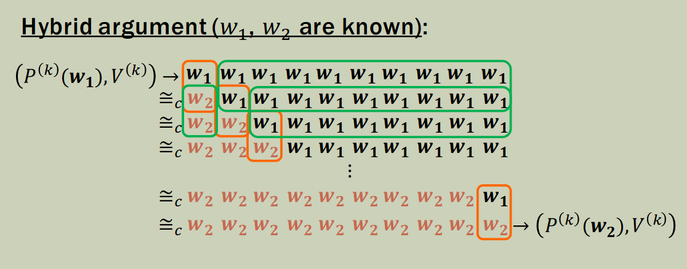

---

Theorem: Assuming non-interactive **statistically-binding** commitments, every $L \in \mathcal{NP}$ has a 3-round **witness-indistinguishable** *proof* with soundness error $2^{-k}$

Theorem: Assuming 2-round **statistically-hiding** commitments, every $L \in \mathcal{NP}$ has a 4-round **witness-independent** *argument* with soundness error $\exp(-\mathcal{O}(k))$

- The protocols are in fact proofs of knowledge
- We will use them to construct 
  - a 5-round SZK argument (of knowledge) for $\mathcal{NP}$
  - a constant-round identification scheme 
  - both with soundness error $\exp(-\mathcal{O}(k))$

---

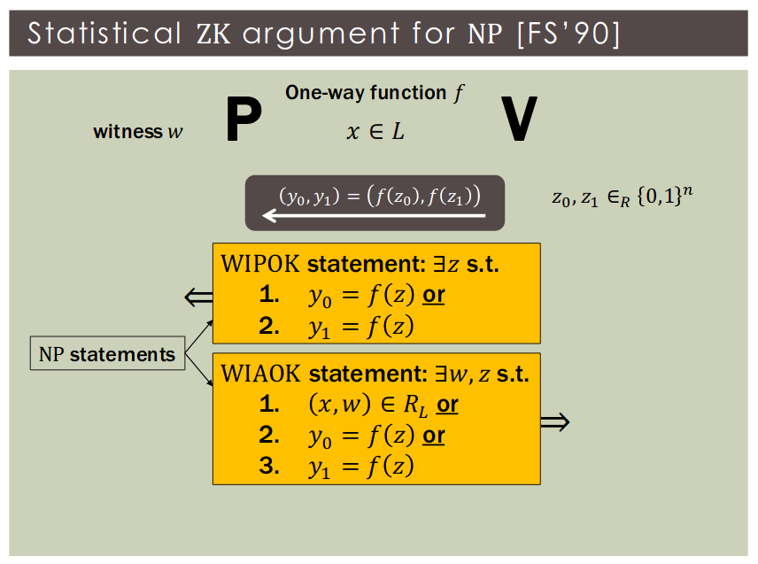

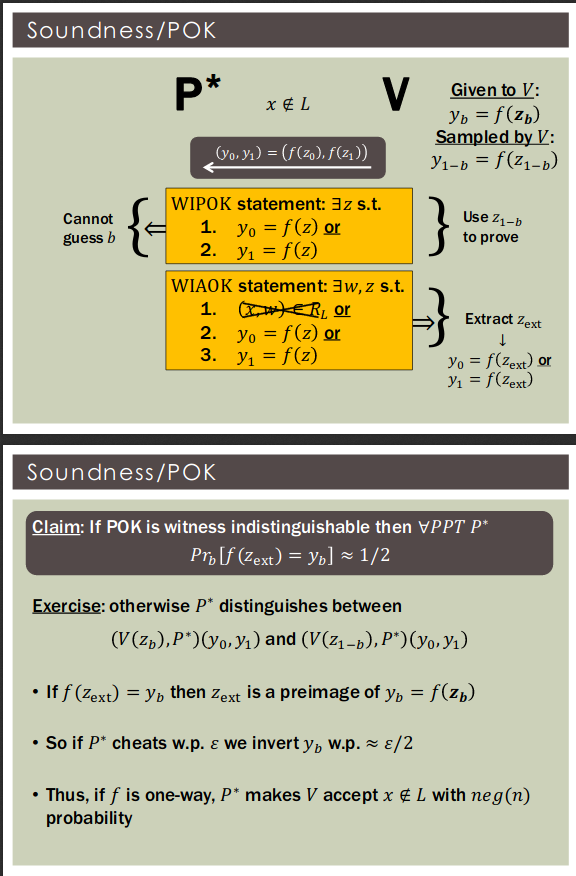

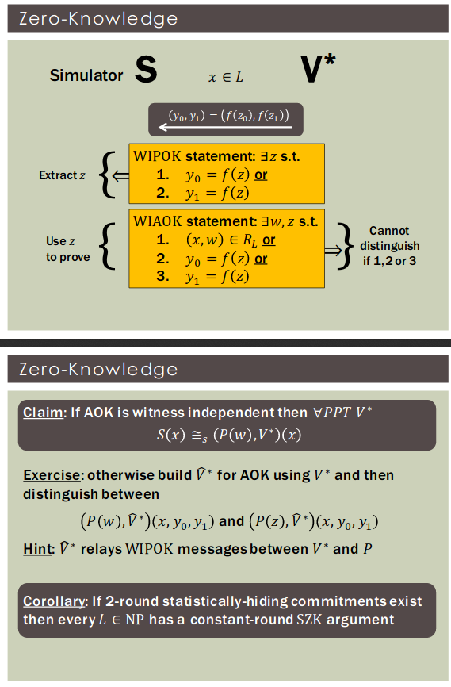

Corollary: If 2-round statistically-hiding commitments exist then every $L \in \mathcal{NP}$ has a constant-round SZK argument. 

In order to get 4-rounds ZK argument more ideas are required [FS'89, BJY'97]

---

Definition [FS'90]:$(P, V)$ is witness hiding with respect to $(Gen, R_L)$, if $\exists$ PPT $M$ $\forall$ PPT $V^*$ 
$$\Pr[(P(w), V^*)(x) \in R_L(x)] \leq \Pr[M^{V^*}(X) \in R_L(x)] + neg(x) $$

- WH is implied by ZK but does not necessarily imply ZK
- Defined with respect to an instance generator $Gen$ for $R_L$

Claim: If an NP-statement $X \in L$ has two independent witnesses then any WI protocol for $x \in L$ is also WH

---
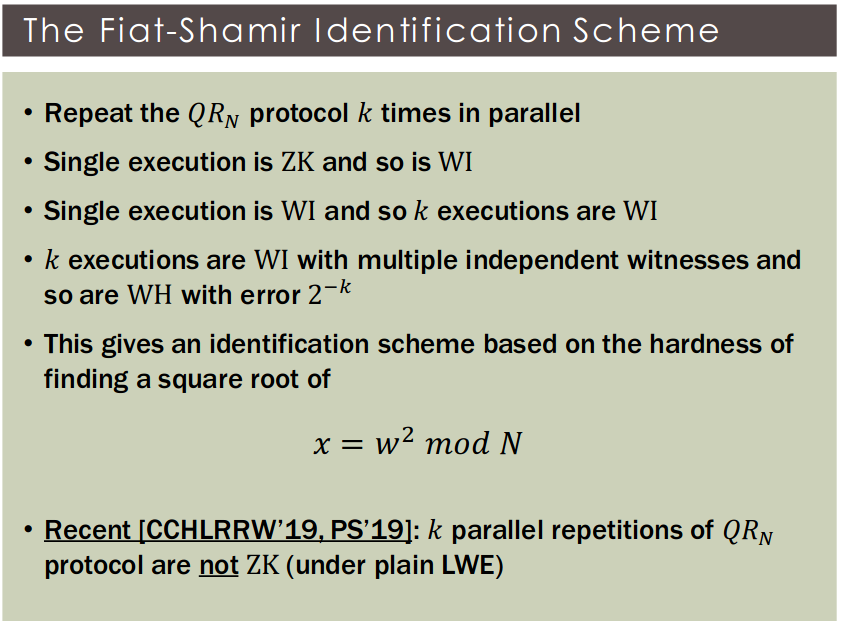

---

## Non-Interactive Zero-Knowledge

Claim: If $L$ has a ZK proof in which prover sends a single message then $L \in \mathcal{BPP}$.

Proof: Decision procedure for 𝐿:
1. Given $x \in L$, run $Sim(x)$ to get a simulated proof $\pi$.
2. Output $V(x, \pi)$.

- Completeness: If $x \in L$ then simulated proof indis. from real proof $\Rightarrow$ $V$ accepts.
- Soundness: If $x \in L$ then $V$ rejects all proofs (whp).

---

Non-Interactive Zero-Knowledge [BFM88]
- Key idea:trusted setup.
- Typically, the Common Reference String (CRS) model.
- A trusted party generates a CRS that all parties can see.
- Even Better: common uniform random string (CURS).

Definition: NIZK
- Completeness: if $x \in L$ $\Rightarrow$ $\Pr[V \text{ accepts }] = 1 - negl$
- Soundness:if $x \notin L$ $\Rightarrow$ $\forall$ PPT $P^*$, $\Pr[V \text{ accepts}] = negl$.
- Zero-Knowledge: “Can simulate view of the verifier”
  - $\exists Sim$ such that for $x \in L$ $Sim(x) \approx_c (CRS, \pi)$

---

Variants of NIZKs
- Multi theorem:can-reuse CRS for many $x$’s.
- Adaptive soundness: sound even if $x \in L$ chosen after CRS.
- Adaptive ZK: ZK distinguisher can choose $x \in L$ after CRS.
- Statistical soundness (proof): sound against unbounded provers.
- Statistical ZK: ZK for unbounded distinguishers.

---

[FLS90]: NIZK for all of NP from Trapdoor Permutations*

Corollary: NIZK based on hardness of factoring.

Other known results:
- Bilinear maps [GOS06].
- Random oracle model.
- Obfuscation [SW13,BP15].
- Optimal hardness assumptions [CCRR18,CCHLRR18]

New & Exciting Feasibility Results [2019]
- LWE + circular security [CLW19]
- LWE! [PS19]

---

The FLS ParadigmConstruction has two main steps:
1. Construct NIZK in the “hidden bits” model.
2. Compile hidden bits NIZK to standard NIZK

## The Fiat-Shamir Transform

The Fiat-Shamir Transform[FS86], Original goal was transforming ID schemes into signature schemes.

---

Theorem[PS96,Folklore]: for every constant-round interactive argument $\Pi$ with negl. soundness, whp over $R$, the protocol $\Pi_R$ is secure.
(Actually extends to some multi-round protocols.)

Claim: $\exists$ multi-round protocol $\Pi$ with negl. soundness error s.t. $\Pi_{FS}$ is **not** sound (even in ROM).

Proof: Take any constant-round protocol with constant soundness and repeat sequentially.

---

Bad news [CHG98]: $\exists$ protocols secure in ROM but totally broken using any instantiation.

Do there exist hash functions for which the Fiat-Shamir transform is secure?
Answer: we don’t (quite) know 

---

Def: a hash family $H$ is **FS-compatible** for a $\Pi$ if $FS_{H}(\Pi)$ is “secure”.

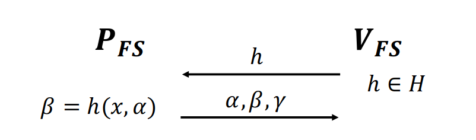

Def: $H$ is programmable if can sample random $h \in H$ conditioned on $h(x, \alpha) =\beta$. 

---

Claim: if $H$ is programmable and $\Pi$ is HVZK $\Rightarrow$ $\Pi_{FS}(h)$ is ZK.

Proof: construct simulator.
1. Sample $(\alpha, \beta, \gamma)$. 
2. Sample $H$ conditioned on $H(x, \alpha) = \beta$.
3. Output $(H, (\alpha, \beta, \gamma))$. 

---

Thm[B01,GK03]: $\exists$ protocols which are not FS-compatible for any $H$.

[BDGJKLW13]: no blackbox reduction to a falsifiable assumption, even for proofs.

---

## Lower Bounds and Limitations on Zero Knowledge 

Unidirectional proof: a single message from $P$ to $V$. 
Example: $\mathcal{NP}$ proofs

Theorem: Suppose that $L$ has a unidirectional ZK proof. Then $L \in \mathcal{BPP}$

Theorem: Suppose that $L$ has a ZK proof in which the verifier $V$ is deterministic. Then $L \in \mathcal{BPP}$

Theorem: Suppose that $L$ has an **auxiliary-input** ZK proof in which the prover $P$ is deterministic. Then $L \in \mathcal{BPP}$. 

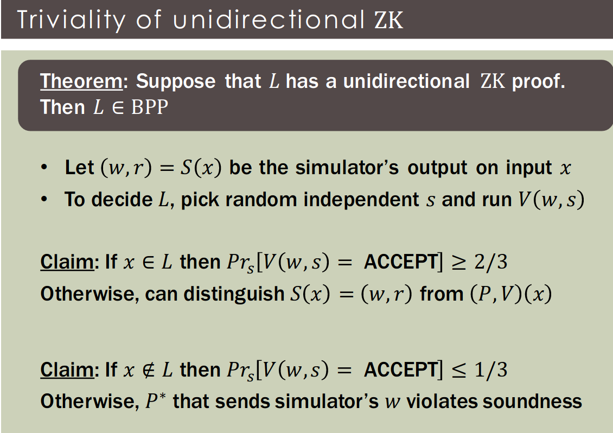

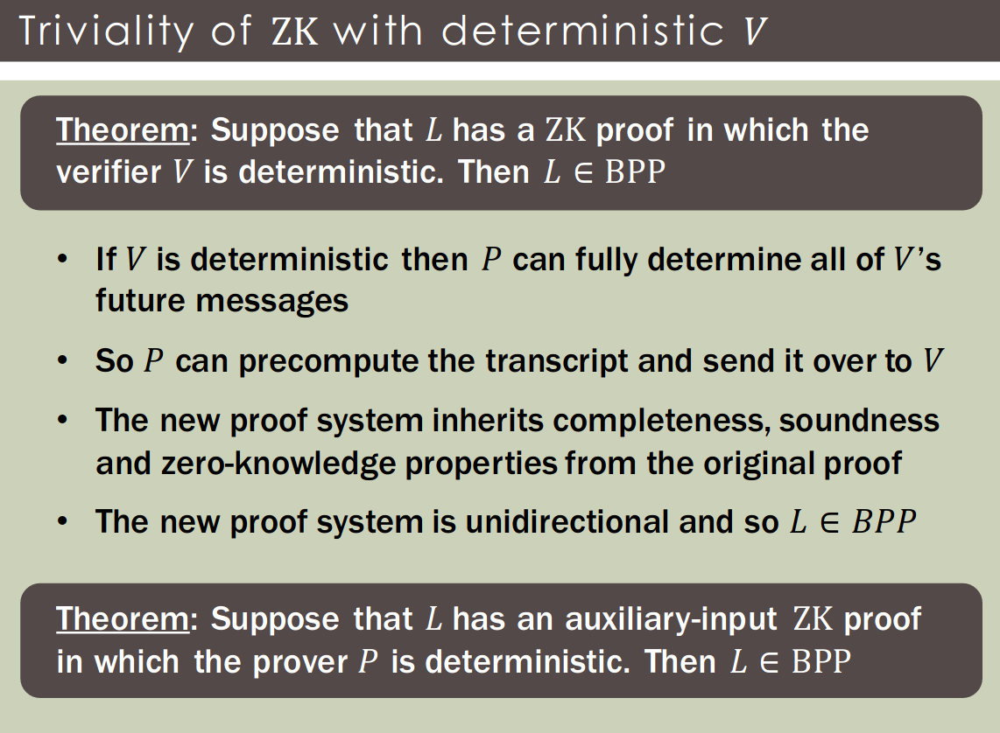

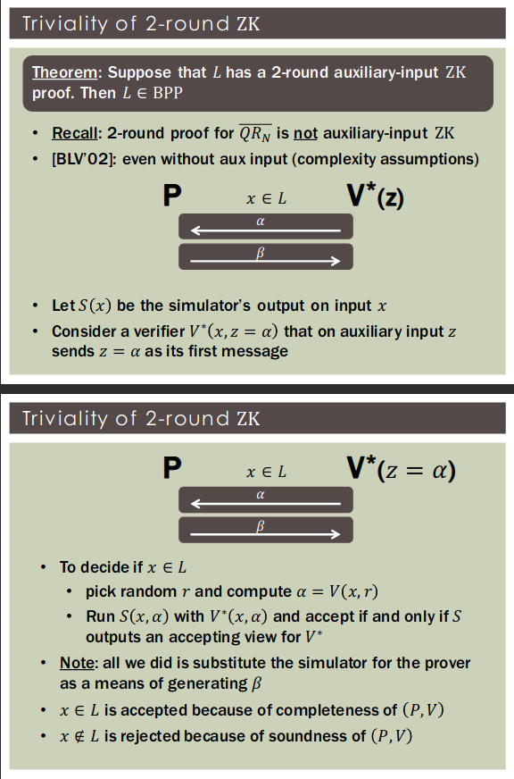

- Problem: $V^*$’s challenge is a string $b \in_R \{0, 1\}^k$
- Simulator’s expected number of guessing attempts is $2^k$
- Solution: Let verifier commit to $b$ in advance
- Yields 5 round proof (assuming OWF, 4-round argument)

---
original: $\forall V^* \exists S$
black-box: $\exists S \forall V^*$

---

- Triviality of BB ZK: only $L \in \mathcal{BPP}$ have (negligible error)
  - constant-round **public-coin** BB ZKproofs/arguments
  - 3-round BB ZKproofs/arguments

- parallel repetition of $HAM$ and $QR_N$ protocols are public-coin
- applies to **any** constant  number  of rounds
- if $HAM, RQ_N \notin \mathcal{BPP}$, even private coins do not help for BB ZK

---
Theorem[GK'91]: Suppose that $L$ has a constant-round, negligible error, public-coin ZKproof. Then $L \in \mathcal{BPP}$. 

Proof idea: 
- Consider a PPT BB simulator $S$ 
- Define a PPT $V^*$ that on input $m_1, \ldots, m_{i-1}$ returns $m_i = f_K(m_1, \ldots, m_{i-1}),where $f_k$ is a pseudorandom function
- To decide if $x \in L$, run $S^{V^*}(x)$ and accept if and only if the resulting transcript is accepting

---

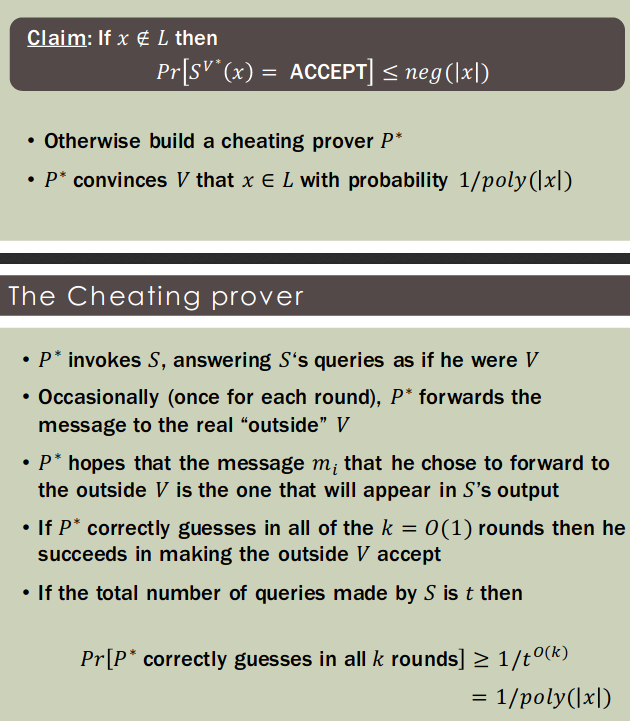

---

Theorem[F'90]: There exists a ZK protocol that does not retain its ZK properties when run twice in parallel.

- There exist two provers $P_1, P_2$ such that each is ZK, but the prover that runs both in parallel yields knowledge
- Specifically, a cheating $V^*$ can extract a solution for a problem that is not solvable in polynomial time
- $P_1$ sends “knowledge” if and only if $V$ can solve a computationally hard challenge generated by $P_1$
- Solutions are pseudorandom but can be verified by $P_1$ (which is unbounded)
- $P_2$ solves such pseudorandom challenges
- Both $P_1, P_2$ are ZK
- $P_1$ because a PPT $V^*$ is unable to solve the challenge and so $P_1$ will not send “knowledge”
- $P_2$ because the solution cannot be verified in poly time
- Can be made to work for poly time $P_1, P_2$ using statistically-binding commitments and ZKPOKs

---

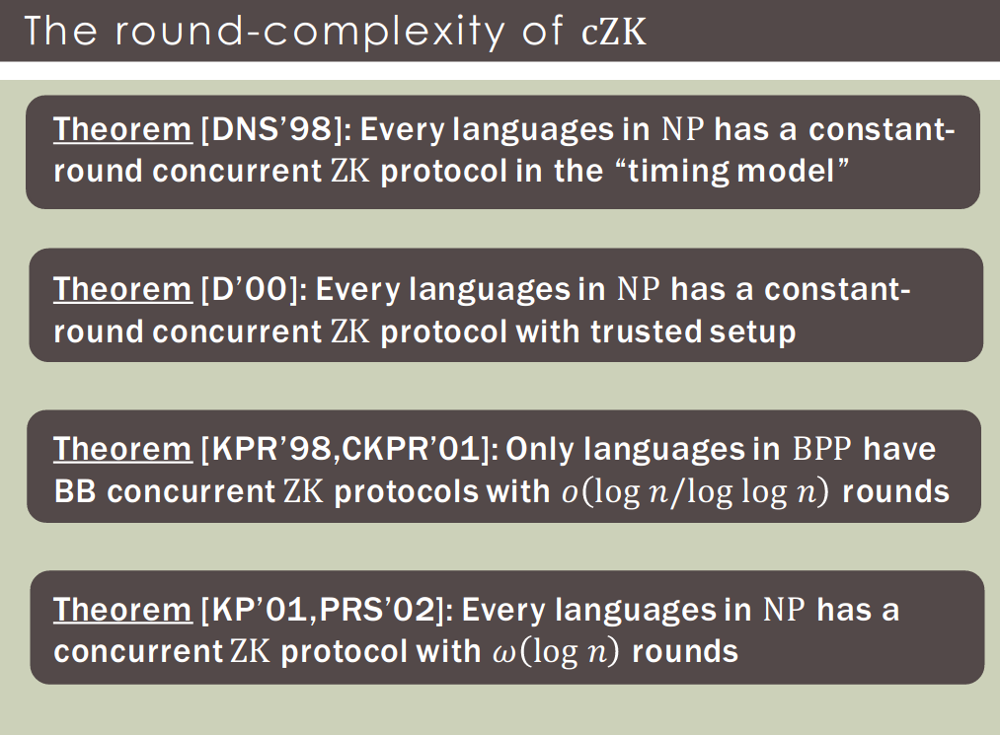

---

## Non Black-Box Zero Knowledge (Barak’s Protocol) 

Goal: construct CZKargument $\forall L \in \mathcal{NP}$
- with negligible soundness
- a constant number of rounds
- and public-coin

No $L \notin \mathcal{BPP}$ has a black-box ZK protocol that is:
- constant-round
- negligible-soundness
- public-coin

So for $L \notin \mathcal{BPP}$ must use a non-black box simulator
- On the one hand, $\forall V^* \exists S$ should be easier than $\exists S \forall V^*$
- On the other hand, where do we even begin?
  - Reverse engineering $V^*$ is difficult!
  - Key insight: there is no need to reverse engineer
  - Enough for $S$ to prove that he possesses $V^*$'s code

Theorem [B'01]: If CRH exist, every $L \in \mathcal{NP}$ has a constant-round, public-coin, negligible-soundness, ZK argument
- Idea: enable usage of verifier’s code as a “fake” witness
- In the real proof, the code is $V$’s random tape
- In simulation, the code is $V^*$'s “next-message function”
- Since $P$ does not have access to $V$'s random tape in real interactions, this will not harm soundness 
- The simulator $S$, on the other hand, will be always able to make verifier accept since it obtains $V^*$’s code as input

---

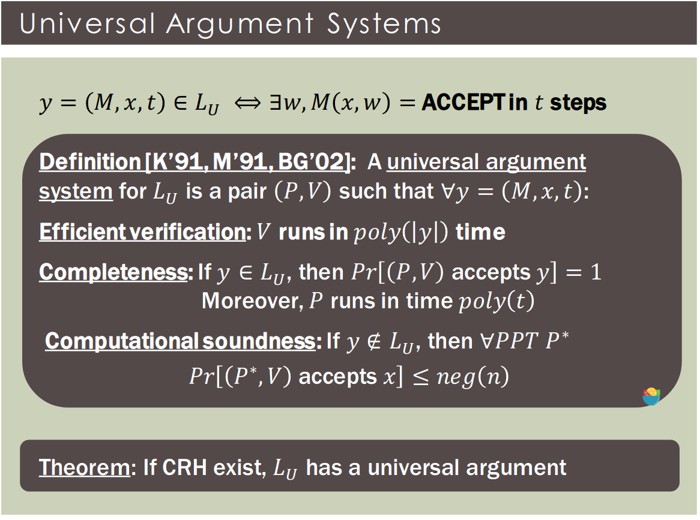

