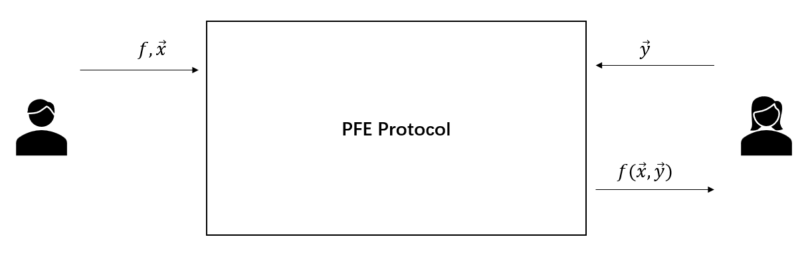

# Research

## Two-party private function evaluation 

### Introduction

The two-party *private function evaluation* (PFE) problem considers the scenario where a party $P_A$ holds a *private function* $f$ and (optionally) a private input $x_A$ while the other party $P_B$ has another private input $x_B$. These two parties intend to *securely* compute $f(x_A, x_B)$ without the existence of a third party. Finally, one or both parties may obtain $f(x_A, x_B)$, while they cannot deduce any other information beyond their specified outputs during the interaction. This task is accomplished just like there exists a trusted third party that receives inputs from two parties, computes $f(x_A, x_B)$, and sends it to one or both parties. 

Since both data and algorithms are valuable in numerous real-world scenarios, such as medical and commercial applications, it is very suitable to use PFE protocols in these scenarios. For instance, we consider the following business scenario between a traditional enterprise and an algorithm-driven company. The traditional enterprise has a dataset, while the algorithm-driven company holds a powerful data mining algorithm that can process this dataset. On the one hand, the algorithm-driven company does not intend to disclose the algorithm. On the other hand, since the dataset may contain sensitive data, the traditional enterprise is unwilling to reveal the dataset to others. We note that this dilemma can be solved by a PFE protocol that allows the traditional enterprise to receive the result of privately running the algorithm on the dataset.

### My work

1. **Making Private Function Evaluation Safer, Faster, and Simpler** [:link:](https://link.springer.com/chapter/10.1007/978-3-030-97121-2_13)
  
    <u>**Yi Liu**</u>, Qi Wang, Siu-Ming Yiu 

    The 25th International Conference on Practice and Theory of Public-Key Cryptography. **PKC 2022**. [[ePrint](https://eprint.iacr.org/2021/1682)]

2. **Improved Zero-Knowledge Argument of Encrypted Extended Permutation** [:link:](https://link.springer.com/chapter/10.1007/978-3-030-88323-2_15)
  
    <u>**Yi Liu**</u>, Qi Wang, Siu-Ming Yiu 

    The 17th International Conference on International Conference on Information Security and Cryptology. **Inscrypt 2021**. [[ePrint](https://eprint.iacr.org/2021/1430)] 

    Extended permutation (EP) is a generalized notion of the standard permutation, and it is useful for the problem of (PFE) to describe the topological structure of the circuit. We provide an improvement for the zero-knowledge argument of encrypted extended permutation protocol. We can instantiate our protocol to be non-interactive, while the previous protocol should be interactive. Meanwhile, compared with the previous protocol, our protocol is faster (e.g., more than $3.4\times$), and the communication cost is only around $24\%$ of the previous one.

## Data trading for function evaluation result

### Introduction

Data trading is an emerging business in which data sellers provide buyers with, for example, their private datasets and get paid from buyers. In many scenarios, sellers prefer to sell pieces of data, such as statistical results derived from the dataset, rather than the entire dataset. Meanwhile, buyers wish to hide the results they retrieve. We are wondering, in the absence of TTP, whether there exists a *practical* mechanism satisfying the following requirements: the seller Sarah receives the payment if and only if she *obliviously* returns the buyer Bob the *correct* evaluation result of a function delegated by Bob on her dataset, and Bob can only derive the result for which he pays. 

Besides, we should ensure the consistency of datasets in two transactions, i.e., for each transaction (with the same buyer or with different buyers), Sarah should use the same dataset $\vec{x}$. In addition, because datasets during data trading tend to remain unchanged and consistent, we prefer a pre-processing procedure that amortizes the processing cost of datasets rather than a one-time solution. Here we call a solution one-time if every execution of such a solution involves a new entire processing procedure of the dataset. 

The question is: 

*How to construct a practical mechanism for the requirements of data trading mentioned above, with the capability of supporting a wide variety of computing tasks?*

### My work

1. **Blind Polynomial Evaluation and Data Trading** [:link:](https://link.springer.com/chapter/10.1007/978-3-030-78372-3_5)
  
    <u>**Yi Liu**</u>, Qi Wang, Siu-Ming Yiu 

    The 19th International Conference on Applied Cryptography and Network Security. **ACNS 2021**. [[ePrint](https://eprint.iacr.org/2021/413)]

    The main contributions of this work are in the following.
    1. Considering the scenario of data trading, we introduce a new cryptographic notion, namely, blind polynomial evaluation. We propose a generic construction of this notion using two compatible homomorphic encryption schemes.
    2. We propose a *small-constant-round* protocol to instantiate the generic construction to support polynomial evaluation over $\mathbb{Z}^*_n$. Furthermore, we extend our instantiation from polynomial evaluation over $\mathbb{Z}^*_n$ to that over $\mathbb{Z}_n$.
    3. We integrate our blind polynomial evaluation protocol with blockchain to support fair exchange in the data trading scenario.

2. **An Improvement of Multi-Exponentiation with Encrypted Bases Argument: Smaller and Faster** [:link:](https://link.springer.com/chapter/10.1007/978-3-030-71852-7_27)
  
    <u>**Yi Liu**</u>, Qi Wang, Siu-Ming Yiu 

    The 16th International Conference on International Conference on Information Security and Cryptology. **Inscrypt 2020**. [[ePrint](https://eprint.iacr.org/2020/567)] 

    This paper provides an improvement for the multi-exponentiation with encrypted bases argument protocol. This protocol can speed up the encryption switching procedure used in the ACNS paper above. 

