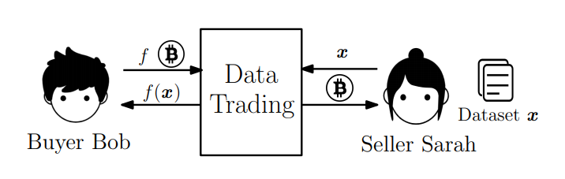

## PKC'22 Making Private Function Evaluation Safer, Faster, and Simpler.

两方隐私函数计算（two-party private function evaluation）指的是在协议参与的两方中，一方Alice提供一个（任意的）隐私函数f和一个输入$x$，另一方Bob提供一个输入$y$，并在最后某一方或双方获得计算结果$f(x, y)$，而双方都不能获得关于对方输入的相关信息。在商业、金融、医疗等场景中，当涉及的数据与算法模型同时需要保密时，隐私函数计算将发挥极大的作用。此工作针对隐私函数计算（private function evaluation）给出了几个提升。首先，本工作给出了在恶意模型下首个常数轮的、线性复杂度的两方隐私函数计算协议。同时，本工作还给出首个在公开可验证隐蔽模型下的常数轮的、线性复杂度的两方隐私函数计算协议。不同于之前的相关协议，这两个协议都实现了全局可重用性。我们引入一个对Alice的隐私函数$f$的预处理环节，进行预处理后，任何扮演Bob角色的参与者都可以重复利用对$f$的预处理内容，更快地与Alice执行针对相同隐私函数$f$在不同输入$x$与$y$上的计算的协议。

## Inscrypt'21 Improved Zero-Knowledge Argument of Encrypted Extended Permutation.

拓展排列（extended permutation）是比排列（permutation）更一般化的定义。相比于排列，拓展排列允许经过映射后，元素被重复增加或者被省略。本工作提供了对零知识加密拓展排列协议的改进版本。这个协议用于通过零知识的方式证明一组密文对应的明文是经由另一组密文对应的明文经过有效的拓展排列得到的。拓展排列可用于描述电路的拓扑结构，因此，这个协议也是线性复杂度隐私函数计算（private function evaluation with linear complexity）协议的重要组成部分。我们提出的改进协议的通讯消耗只有之前协议的$24\%$，同时，我们协议的计算速度是之前协议的三倍。

## ACNS'21 Blind Polynomial Evaluation and Data Trading. 

这个工作考虑在数据交易场景中隐私多项式在秘密数据上计算与计算结果的公平交易问题。假设在数据交易场景中，数据卖家Sarah拥有一个私密数据集，而潜在的数据买家Bob希望在这个数据集上做计算，并获得计算结果。然而，Sarah不愿意一次性公开整个数据集，只希望每次只公开一个数据计算结果，而Bob则不想公布他要在数据集上进行的计算内容及计算结果。他们希望有一个不借助第三方平台的方案，这个方案确保Bob最终只能获得在Sarah数据集上进行他指定的计算函数所得到的计算结果，而Sarah不能获得关于Bob进行的计算的相关信息。同时，方案需要确保当且仅当Sarah收到Bob的付款时，Bob能得到最终的计算结果。下图给出这个方案需求的图示。

在这个工作中，我们提出盲多项式计算（blind polynomial evaluation）的概念，并给出一个针对Bob的计算函数为多变量多项式的基于区块链的数据交易方案。该方案在涉及恶意参与者时仍然是安全的。同时，我们的方案还实现多次可用性和针对多个数据买家的数据一致性等性质。

## Inscrypt'20 An Improvement of Multi-exponentiation with Encrypted Bases Argument: Smaller and Faster. 
指数乘积（multi-exponentiation）运算旨在计算如下函数：
$$f(x_1, \ldots, x_n) = x_1^{\lambda_1}\cdots x_n^{\lambda_n}$$
其中$\lambda_i$为给定的公共参数。这种运算在密码学中非常常见。我们考虑当$x_1, \ldots, x_n$以加密形式给出时，如何通过零知识（zero-knowledge）的方式证明某个（加密的）值为对应指数乘积运算结果$f(x_1, \ldots, x_n)$这个问题。解决这个问题的协议被称为为*multi-exponentiation with encrypted bases argument（MEB）*。本工作从协议计算量和通讯量两方面给出比现有的此类协议更高效的方案。我们的协议相比之前的协议减少了$29\%$的通讯量和$19\%-42\%$的计算量。我们协议不仅可以提高如加密转换协议（encryption switching protocols）、孪生密文证明（twin-ciphertext proof）、盲多项式计算（blind polynomial evaluation）等以此协议作为组件的协议的执行效率，还对如下相关场景有直接的应用价值。假设Alice拥有某个数据集$\{d_i\}_i$，她通过加法同态加密（additively homomorphic encryption）的方式逐个加密整个数据集，并对外公开这个加密数据集。此时，Bob可以下载这个加密数据集，并提供一个如下形式的函数：
$$f(x_1, \ldots, x_n) = \prod_j (\sum_i a_i d_i)^{\lambda_i}$$
其中$a_i$和$\lambda_j$为Bob指定的参数。这样，当Alice将计算结果$f(x_1, \ldots, x_n)$发给Bob的同时，她可以通过MEB协议证明这个计算结果的正确性，而不泄露其他相关信息。

